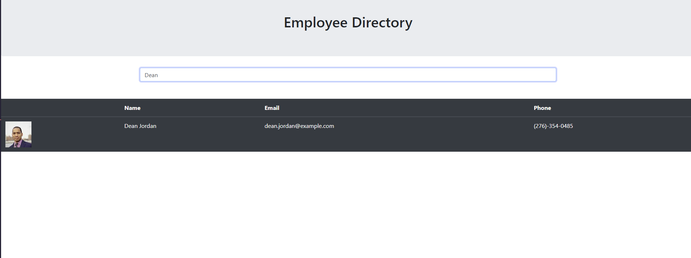
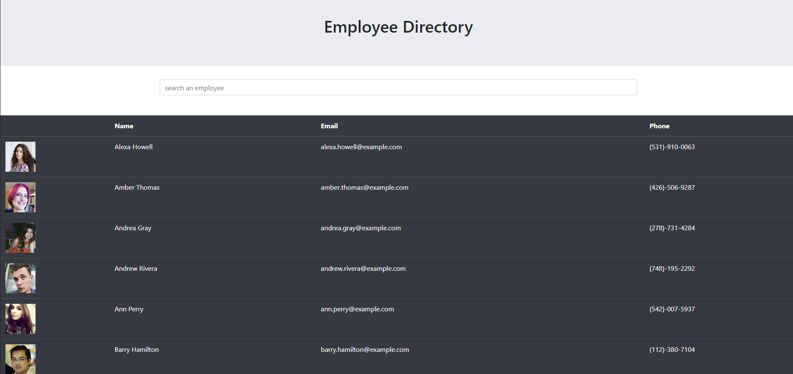

# Employee Directory

  
  ## Table of Contents
  [Description](#description)

  [Installation](#installation)

  [Usage](#usage)

  [License](#license)

  [Questions](#questions)
  ## Description
  This program allows users to organize and filter employee or user information using React functionality.<br> 
  Github Deployed link:<br>
  [github deployed link](https://mgmoreno22.github.io/EmployeeDirectory/)

  ## Installation
  Developers may install dependencies within the package.json file with the following command in your terminal:
  ```bash
  npm install
  ```
  React program was created with "npx create" function
  ```bash
  npx create-react-app EmployeeDirectory
  ```
  ## Usage
  The program will automatically generate a randomized list of 100 users. By typing into the search bar, users will be filtered out based on matching names.<br>
   <br><br>
  By clicking the "Name" in Name column, users will be alphabetized by first name from A-Z. If it is clicked again, users will be alphabetized from Z-A.<br>
  
  ## License
  MIT
  ## Questions
  For any further questions, you may contact me at:<br>
  github: http://github.com/mgmoreno22<br>
  email: MichaelMoreno751@gmail.com
